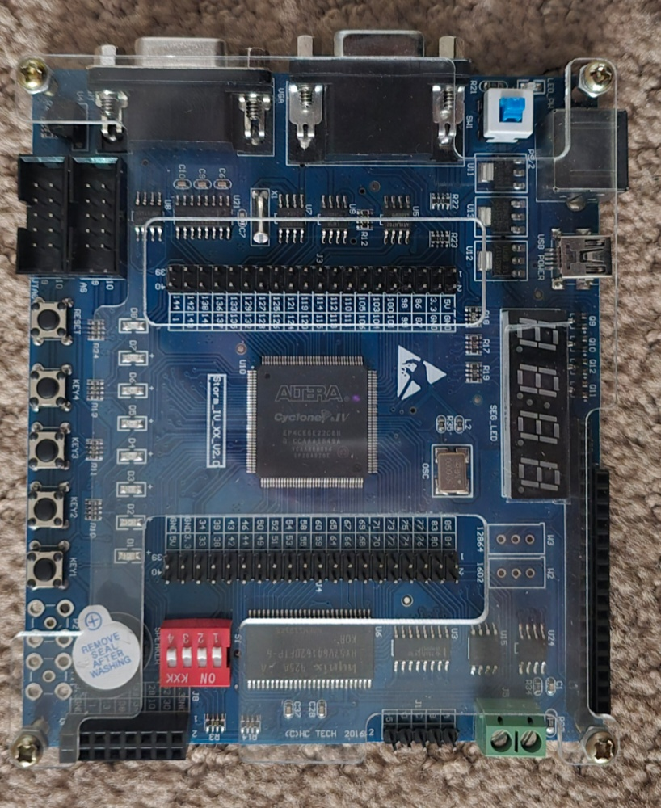
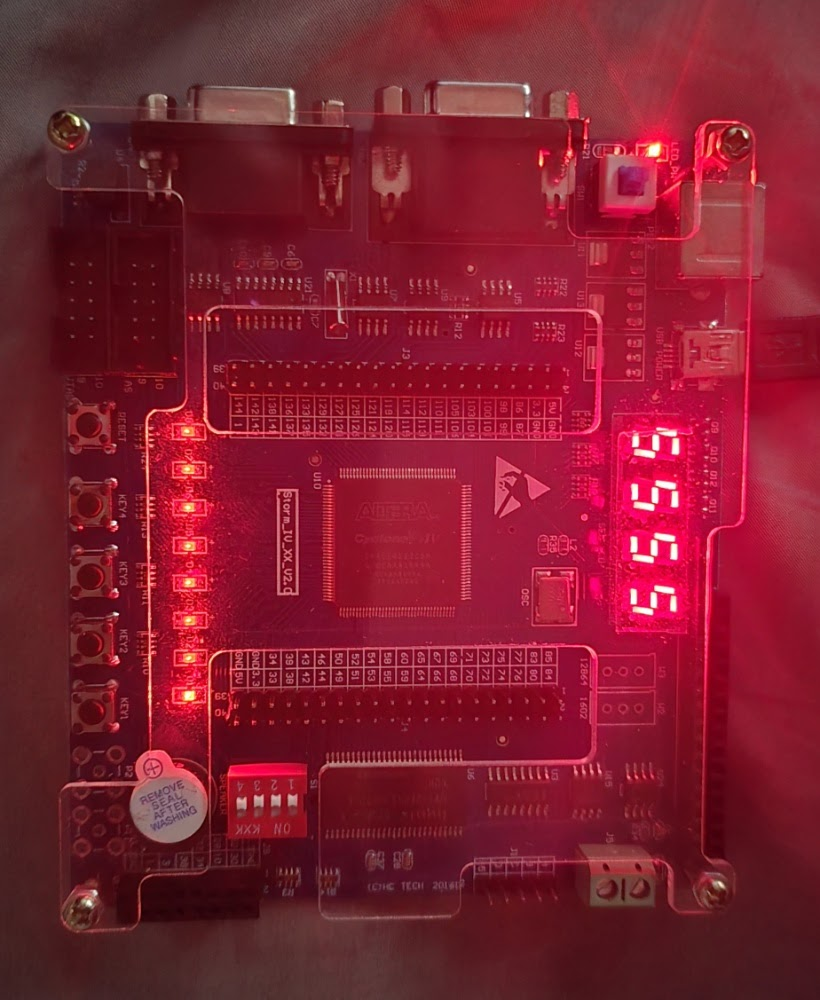

# Storm IV V2.0 (Altera Cyclone IV) FPGA Project

This repository contains Verilog code and pin assignments for the **Storm IV XX V2.0** FPGA development board. It serves as a comprehensive hardware diagnostic tool that walks you through testing the **push buttons**, **DIP toggles**, **onboard buzzer**, **LEDs**, and the **4-digit 7-segment display**.

It includes a complete pin mapping correction for the V2.0 board variant, which differs significantly from the standard documentation.

## Hardware Gallery

| **Storm IV V2.0 Board Layout** | **EP4CE6E22C8N Chip Detail** |
|:---:|:---:|
|  |  |
| *Top view of the Storm IV V2.0 dev board (Cyclone IV)* | *Macro shot of the specific EP4CE6E22C8N FPGA silicon* |

## Demo Functionality
The included code (`fpga_storm_iv_demo.v`) implements a full-board diagnostic. Here is what happens when you run it:

1.  **7-Segment Display:** Automatically counts from `0000` to `9999` (1 increment/sec).
2.  **Push Buttons:** Pressing **ANY** key (KEY1-KEY4) instantly toggles the 8 LEDs (ON $\leftrightarrow$ OFF).
3.  **DIP Switches & Buzzer:**
    * Flip Switch **ON** $\rightarrow$ **1 Beep**.
    * Flip Switch **OFF** $\rightarrow$ **2 Beeps**.

## Verified Pin Mapping (V2.0)
*Crucial: These pins differ from the standard Storm IV V1 manuals.*

| Component | Signal | Pin Number |
| :--- | :--- | :--- |
| **System** | Clock (50MHz) | `PIN_91` |
| **Buttons** | KEY1..KEY4 | `PIN_34`, `PIN_33`, `PIN_88`, `PIN_89` |
| **DIPs** | SW1..SW4 | `PIN_11`, `PIN_25`, `PIN_24`, `PIN_23` |
| **LEDs** | D1..D8 | `PIN_39`, `PIN_31`, `PIN_3`, `PIN_2`, `PIN_1`, `PIN_144`, `PIN_143`, `PIN_142` |
| **7-Seg Sel** | Digit 1..4 | `PIN_98`, `PIN_99`, `PIN_86`, `PIN_87` |
| **7-Seg Data**| A,B,C,D,E,F,G,DP | `100`, `111`, `104`, `110`, `106`, `101`, `103`, `105` |
| **Audio** | Buzzer | `PIN_7` |

### Action Shot
Running the `fpga_storm_iv_demo` project:

*Status: 7-Segment counting (0-9999), binary LEDs toggling, and button inputs active.*

---

## Software & Development Guide

### 1. Prerequisite Software
This project uses **Intel Quartus Prime Lite Edition** (Free).
* **Download:** [Intel FPGA Software Download Center](https://www.intel.com/content/www/us/en/software-kit/665990/intel-quartus-prime-lite-edition-design-software-version-20-1-1-for-windows.html)
* **Drivers:** On Linux, ensure you have set up `udev` rules for the **USB-Blaster**.

### 2. How to Open & Edit Code
1.  Launch Quartus Prime.
2.  Go to **File** $\rightarrow$ **Open Project**.
3.  Select the file: `fpga_storm_iv_demo.qpf`.
4.  To edit the logic, double-click **`fpga_storm_iv_demo.v`** in the "Project Navigator" (left panel).
    * *Example:* Change `one_sec_timer` to speed up the counter, or change the `beep_state` logic to create different tunes.

### 3. How to Compile
1.  Click the blue **Play Button** (Start Compilation) in the top toolbar.
2.  Wait for the progress bar to reach 100% (Green Checkmark).
3.  *Note:* Ensure the device is set to **Cyclone IV E** (EP4CE6E22C8) in Assignments $\rightarrow$ Device.

### 4. How to Upload (Flash)
1.  Connect the **USB-Blaster** to your computer and the board's JTAG header.
2.  Connect the board's power cable (LEDs should light up).
3.  In Quartus, go to **Tools** $\rightarrow$ **Programmer**.
4.  Click **Hardware Setup** and select **USB-Blaster**.
5.  Click **Start**.
    * *Troubleshooting:* If it fails, click **Auto Detect**, verify the chip is `EP4CE6`, re-select the `.sof` file, and try again.
